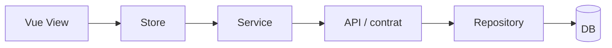

# Skill cc-plan

Ce skill produit un seul plan d'implémentation, actionnable et ancré dans le code. Il est pensé pour la planification avant implémentation et doit rester très près de la vraie source de vérité du projet.

## Règles dures

- Toujours poser les questions de clarification avant de produire le plan si un des éléments suivants est ambigu : intention business, portée, maquettes, edge cases, critères d'acceptation, mode cible, frontières de module ou de fichier.
- Ne jamais produire plus d'une approche recommandée. Choisir la meilleure, la justifier, et garder les alternatives seulement comme notes courtes `Alternatives rejetées`.
- Ne jamais écrire de code final hors du plan. Le planning est en lecture seule.
- Ne jamais sauter l'étape Jira quand l'utilisateur mentionne une clé de billet Jira (ex. `ABC-123`). Si Jira n'est pas accessible dans le harnais courant et qu'aucune autre capacité tracker équivalente n'est disponible, arrêter et le dire clairement.
- Toujours lister les guidelines, règles et conventions applicables du projet, puis confirmer explicitement dans le plan qu'elles seront respectées.
- Toujours interroger ByteRover après avoir récupéré le contexte du billet ou de la demande quand ByteRover est installé ou configuré dans le projet.
- Si ByteRover n'est pas disponible, inaccessible, en erreur, ou ne renvoie rien d'utile, noter la limite puis continuer avec le reste du contexte disponible. Ne jamais bloquer le plan sur ByteRover.
- Toujours fournir une preuve explicite que le plan couvre tous les critères d'acceptation.
- Toujours définir ce qui est hors scope quand le billet ou la demande est ambigu, pour éviter le scope creep.
- Toujours signaler l'impact cross-repo quand un changement touche plusieurs repos ou contrats.

## Plan Progress

Copier cette checklist dans la réponse et la cocher au fur et à mesure :

- [ ] 1. Contexte Jira (ticket + Epic + billets liés) OU description fournie par l'utilisateur
- [ ] 2. Maquettes / contexte visuel
- [ ] 3. Requête ByteRover à partir des mots-clés de l'étape 1 (si installé/configuré)
- [ ] 4. Exploration du codebase (fichiers impactés, patterns)
- [ ] 5. Guidelines / règles / conventions applicables identifiées
- [ ] 6. Questions de clarification posées si nécessaire
- [ ] 7. Plan rédigé (une seule solution recommandée)
- [ ] 8. Diagramme Mermaid inclus
- [ ] 9. Preuves code (références existantes + snippets proposés)
- [ ] 10. Edge cases et gestion d'erreurs listés
- [ ] 11. Section hors-scope remplie
- [ ] 12. Impact cross-repo évalué
- [ ] 13. Critères d'acceptation ↔ étapes d'implémentation tracés
- [ ] 14. Impact i18n évalué

## Workflow

### Étape 1 — Contexte Jira ou source de vérité

Si un billet Jira est mentionné :

- Utilise d'abord la capacité Jira disponible dans le harnais courant.
- Récupère au minimum :
  1. le billet ciblé : résumé, description, critères d'acceptation, commentaires
  2. son Epic parent si présent : objectif, scope
  3. les billets liés : `blocks`, `is blocked by`, `relates to`, dépendances utiles
- Si un de ces éléments est manquant, contradictoire ou inaccessible, pose la question de clarification avant le plan.
- Si Jira n'est pas disponible dans l'environnement et qu'aucun fallback tracker fiable n'existe, arrête et dis-le. N'invente pas le contexte.

Si aucune clé Jira n'est fournie :

- Travaille à partir de la description libre de l'utilisateur.
- Confirme la portée avant d'aller plus loin si elle n'est pas fermée.

### Étape 2 — Maquettes

Si l'utilisateur fournit des maquettes ou captures :

- Analyse le layout, les états, le copy et les edge cases visibles.

Si aucun contexte visuel n'est fourni alors que le changement est UI :

- Demande explicitement : `Y a-t-il une maquette (Figma, image, lien) pour ce changement ?`

### Étape 3 — ByteRover

Une fois le sujet connu :

- Si ByteRover est installé, configuré, ou si le projet expose clairement sa présence (par exemple via `.brv/`), lance la requête avec des mots-clés concrets extraits du billet ou de la demande : nom de feature, entités métier, fichiers mentionnés, endpoints, modules.
- Si ByteRover n'est pas installé ou configuré dans le projet, passe cette étape sans bloquer le plan.
- Si ByteRover est disponible mais inaccessible, en erreur, ou si rien de pertinent ne ressort, continue sans bloquer le plan et note la limite seulement si elle affecte la qualité du plan.

### Étape 4 — Ancrage dans le codebase

Le plan doit être ancré dans le vrai codebase, pas dans des hypothèses.

Capture explicitement :

- les fichiers réellement impactés
- les patterns existants à réutiliser (`repository`, `service`, `composable`, `store`, etc.)
- toute incohérence entre le billet et le code actuel

### Étape 5 — Guidelines / règles applicables

Liste les guidelines, règles et conventions pertinentes pour le changement. Pour chacune, dis en une ligne comment le plan s'y conforme.

Les formes exactes peuvent varier selon le projet. Par exemple :

- `.cursor/rules/*.mdc`
- `.claude/rules/*`
- `.ai/guidelines/*`
- `CLAUDE.md`
- `AGENTS.md`
- documents d'architecture ou de conventions proches du module touché

Dans le plan final, confirme explicitement que ces règles seront respectées.

### Étape 6 — Questions de clarification

Si l'intention business, la portée, les contrats, les maquettes ou l'UX sont ambigus, pose les questions de clarification avant d'écrire le plan. Ne suppose pas silencieusement.

### Étapes 7 à 10 — Rédiger le plan

Le plan doit :

- rester sous une taille raisonnable
- être concret
- citer le code existant avec des références `start:end:path`
- proposer de petits extraits de forme de code, sans implémenter la solution complète

## Template de plan

````markdown
# Plan — <Clé de billet ou sujet> · <Titre court>

## 1. Contexte métier
- **Ticket**: <KEY ou N/A> — <summary> (<status si disponible>)
- **Epic**: <KEY ou N/A> — <objectif>
- **Liens**: <blocks / depends on / relates to>
- **Objectif business**: <1–2 phrases>
- **Critères d'acceptation**:
  - AC1. ...
  - AC2. ...

## 2. Contexte visuel
- **Maquettes**: <liens / "aucune fournie — confirmé avec l'utilisateur" / N/A>
- **États UI couverts**: <default / loading / empty / error / edge>

## 3. Analyse de l'existant
- **Fichiers impactés**:
  - `path/to/file.ts` — <rôle actuel>
  - `path/to/other.vue` — <rôle actuel>
- **Patterns réutilisés**: <repository / service / composable / store / ...>
- **Écarts ticket vs code actuel**: <si présent, sinon "aucun écart notable">

Référence de code existant :

```<start>:<end>:<path>
<extrait pertinent>
```

## 4. Solution recommandée

### 4.1 Architecture (Mermaid)

Inclure un diagramme dès que le changement touche plus d'une couche ou introduit un nouveau composant. Sinon écrire `N/A - changement isolé dans <fichier>`.



### 4.2 Décisions clés
- **Décision**: <ex. extraire un `XyzService`>
  - **Pourquoi**: <SOLID/SRP - la logique X n'a rien à faire dans Y>
  - **Alternatives rejetées**: <option B - raison courte>

### 4.3 Edge cases et gestion d'erreurs
- <ex. valeur nulle, permission refusée, requête concurrente, timeout réseau> -> <comportement attendu>

### 4.4 Changements proposés

**Nouveau** `src/services/XyzService.ts`:

```ts
export class XyzService {
  constructor(private readonly repo: XyzRepository) {}

  public async doThing(input: XyzInput): Promise<XyzResult> {
    // ...
  }
}
```

**Modification** `src/controllers/AbcController.ts` :

```ts
// Avant
this.repo.doThing(input);

// Après
this.xyzService.doThing(input);
```

## 5. Conformité aux règles projet
- **Guidelines / règles appliquées et respectées**:
  - `.cursor/rules/<rule>.mdc` -> <comment respecté>
  - `.claude/rules/<rule>.md` -> <comment respecté>
  - `CLAUDE.md` -> <comment respecté>

## 6. Principes appliqués
- **SOLID**: <SRP / OCP / DIP — ce que la solution garantit>
- **DRY**: <duplication évitée — où / comment>
- **Clean Code**: <nommage, taille de fonction, lisibilité>

## 7. Impact i18n
- **Clés / messages impactés**:
  - `feature.xyz.title`
  - `feature.xyz.cta`
- Aucune clé orpheline / aucune string hardcodée.
  (Marquer `N/A` si le changement est purement backend.)

## 8. Étapes d'implémentation (ordonnées)
Chaque étape doit référencer le ou les critères d'acceptation couverts.

1. <étape atomique> — couvre AC#1, AC#2
2. <étape atomique> — couvre AC#3

## 9. Hors scope
Ce qui ne sera pas fait dans ce plan, et pourquoi :
- <élément exclu> — <raison>

## 10. Impact cross-repo / cross-contrat
- **Contrat API modifié**: <oui/non — endpoint, payload>
- **Action requise côté autre repo**: <description ou "aucune">
  (Marquer `N/A` si le changement reste dans un seul repo.)

## 11. Risques et points d'attention
- <risque> -> <mitigation>

## 12. Questions ouvertes
- <question restante adressée à l'utilisateur ou au PO>

## 13. Couverture des critères d'acceptation
Preuve explicite que le plan couvre tous les critères d'acceptation :

| AC | Étapes | Notes |
| --- | --- | --- |
| AC#1 | 1 | ... |
| AC#2 | 1, 2 | ... |
````

## À ne pas faire

- ❌ Plan vague sans références de fichiers ni snippets
- ❌ Multiples solutions présentées comme équivalentes
- ❌ Ignorer l'Epic et les billets liés
- ❌ Hypothèses silencieuses sur la maquette ou le contrat API
- ❌ Mentionner `respecte SOLID` sans expliquer concrètement où
- ❌ Oublier la section i18n quand le changement touche l'UI ou des messages utilisateur
- ❌ Lister des étapes d'implémentation sans preuve explicite que le plan couvre les critères d'acceptation
- ❌ Plan purement `happy path` sans edge cases ni gestion d'erreurs
- ❌ Oublier l'impact cross-repo quand le changement touche un contrat API ou un repo voisin
